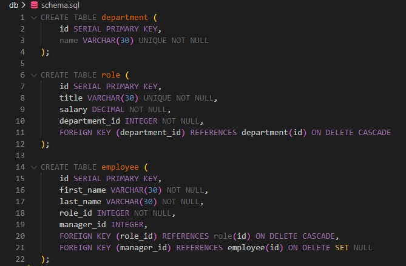

# Employee Tracker CLI Application

## Description
The **Employee Tracker** is a command-line application that allows business owners and HR personnel to efficiently manage company departments, roles, and employees. Built with **Node.js**, **Inquirer**, and **PostgreSQL**, this tool provides an intuitive interface for performing CRUD operations on an employee database.

## Table of Contents
- [Installation](#installation)
- [Usage](#usage)
- [Features](#features)
- [Database Schema](#database-schema)
- [Technologies Used](#technologies-used)
- [Demo](#demo)
- [License](#license)
- [Questions](#questions)

## Installation
1. Clone the repository:
   ```sh
   git clone https://github.com/Mimosquera/10-bootcamp-hw.git
   cd 10-bootcamp-hw
   ```
2. Install dependencies:
   ```sh
   npm install
   ```
3. Set up the database:
   - Ensure PostgreSQL is installed and running.
   - Create the database:
     ```sh
     psql -U postgres -d employee_db -f db/schema.sql
     psql -U postgres -d employee_db -f db/seeds.sql
     ```
4. Configure environment variables:
   - Create a `.env` file in the root directory and add:
     ```sh
     PG_HOST=localhost
     PG_USER=postgres
     PG_PASSWORD=your_password
     PG_DATABASE=employee_db
     PG_PORT=5432
     ```

## Usage
To start the application, run:
```sh
node index.js
```
Follow the prompts to navigate through the menu and manage departments, roles, and employees.

## Features
- View all departments, roles, and employees.
- Add new departments, roles, and employees.
- Update employee roles.
- User-friendly command-line interface with **Inquirer.js**.
- **PostgreSQL** for structured data management.

## Database Schema
The application follows a relational database schema with three tables:

- **department**: Stores department names.
- **role**: Stores job titles, salaries, and department associations.
- **employee**: Stores employee details, including role and manager relationships.



## Technologies Used
- **Node.js**
- **Inquirer.js (v8.2.4)**
- **PostgreSQL**
- **pg (node-postgres)**
- **dotenv**

## Demo
A walkthrough video demonstrating the application's functionality can be found here:
[Click to Watch](./Assets/demo-video.mp4)

## License
This project is licensed under the MIT License.


## Questions
For questions, reach out via:
- **GitHub**: [Mimosquera](https://github.com/Mimosquera)
- **Email**: michael2000ny@gmail.com